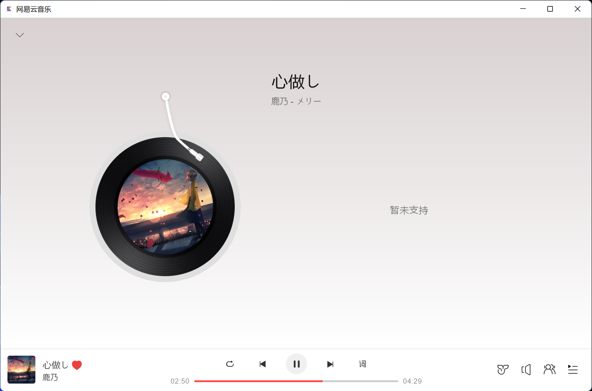

# Introduce

This is a local music player, imitates the UI of Netease Music client.

The UI was built on [Jetbrains Compose](https://github.com/JetBrains/compose-jb/releases).

## Screenshots

## Features

- [x] Parse and play local musics
  - [ ] Resizable table column
- [x] Control music
  - [x] Pause and resume
  - [x] Control progress
- [ ] Playlist
  - [ ] Manage songs in playlist
  - [ ] Next button and previous button
  - [ ] Play mode (cycle, random, etc...)
- [ ] Playing screen
  - [ ] Display visual scrolling lyric
  - [x] Animating album
- [ ] Floating lyric

## Supported music format

Benefited from ffmpeg, supports all formats that ffmpeg supports. (e.g: `mp3`, `flac`, `aag`, `wav`, etc)

## Dependencies

- `ffmpeg` - To parse music metadata and decode music into raw wave data.
- [bytedeco/javacv](https://github.com/bytedeco/javacv) - Provides a java wrapper to use ffmpeg.
  - This project uses an altered version to specify charset (`libs/javacv.jar`), once the original version supports it, I will remove it.